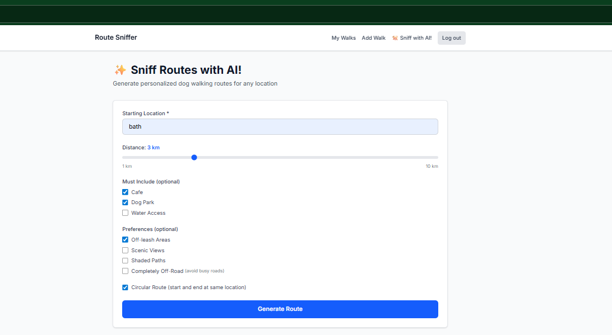
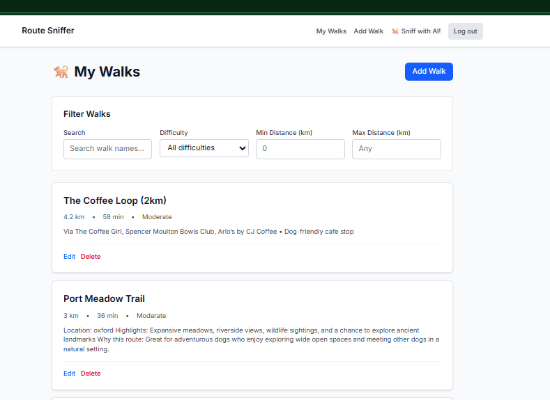

# 🐕 Route Sniffer

> AI-powered dog walking route planner

[](https://nextjs.org/)
[](https://www.typescriptlang.org/)
[](https://openai.com/)
[](https://developers.google.com/maps)


**[🔗 Live Demo](https://route-sniffer.vercel.app/)** | **[📖 Architecture Docs](./documentation/)**

| Search for routes | AI generates waypoints | Save your favourites |
|:-:|:-:|:-:|
|  |  |  |

## Why I Built This

I love going on new adventures with my Springer Spaniel, Obi. None of the apps I explored could create new, unique walking routes easily - so I built my own.

This project let me explore modern full-stack patterns I was curious about: orchestrating multiple AI/map APIs in a single request, React Server Components with optimistic UI updates, and building with cost-consciousness in mind (~$0.04 per AI-generated route).

## How It Works

```
User Input → Geocoding API → Places API → OpenAI GPT-4o-mini → Directions API → Map Display
```

The interesting part is the AI orchestration. A single "generate route" request:

1. Geocodes the user's location text to coordinates
2. Finds nearby points of interest via Google Places
3. Sends POIs to GPT-4o-mini to intelligently select waypoints based on user preferences
4. Calculates the actual walking route via Directions API
5. Displays the interactive map

```typescript
'use server'
export async function generateCustomRoute(location: string, preferences: RoutePreferences) {
  const user = await getUser()
  if (!user) throw new Error('Unauthorized')
  
  // Multi-API orchestration in a single server action
  const coords = await geocodeLocation(location)
  const pois = await findNearbyPOIs(coords, preferences)
  const selectedWaypoints = await aiSelectWaypoints(pois, preferences) // GPT-4o-mini
  const route = await getDirections(coords, selectedWaypoints)
  
  return route
}
```

**Cost protection:** Feature flags for emergency disable, hard budget limits on OpenAI, model selection (GPT-4o-mini is 15x cheaper than GPT-4o).

## Tech Stack

| Category | Technology | Purpose |
|----------|-----------|---------|
| **Framework** | Next.js 16 (App Router) | Server Components + Server Actions |
| **Language** | TypeScript (strict) | Full type safety |
| **Database** | PostgreSQL (Supabase) | With Row-Level Security policies |
| **Auth** | Supabase Auth | Secure authentication |
| **Styling** | Tailwind CSS v4 | Utility-first CSS |
| **Testing** | Vitest + RTL | 199 tests, TDD approach |

### External APIs

| API | Usage | Cost |
|-----|-------|------|
| **OpenAI GPT-4o-mini** | Waypoint selection | ~$0.03/route |
| **Google Maps APIs** | Geocoding, Places, Directions, Display | Free tier sufficient |

**Total cost per route:** ~$0.04

<details>
<summary><strong>🚀 Getting Started (Local Development)</strong></summary>

### Prerequisites
- Node.js 18+
- Supabase account (free tier works)
- OpenAI API key
- Google Cloud account (Maps APIs enabled)

### Setup

```bash
git clone https://github.com/SamOllason/woof-woof-walkies.git
cd woof-woof-walkies
npm install
cp .env.example .env.local
```

Configure `.env.local`:
```env
NEXT_PUBLIC_SUPABASE_URL=your_supabase_project_url
NEXT_PUBLIC_SUPABASE_ANON_KEY=your_supabase_anon_key
OPENAI_API_KEY=sk-...
GOOGLE_MAPS_API_KEY=AIza...
NEXT_PUBLIC_GOOGLE_MAPS_API_KEY=AIza...
AI_RECOMMENDATIONS_ENABLED=true
```

Run:
```bash
npm run dev        # Development server
npm test           # Run tests
npm run test:watch # Watch mode
```

### API Setup

**OpenAI:** Sign up at platform.openai.com, create API key, set spending limits ($10/month recommended).

**Google Maps:** Enable Geocoding, Places, Directions, and Maps JavaScript APIs. Restrict key to your domain for production.

</details>

## Deployment

Zero-config deployment on Vercel - push to GitHub, import at vercel.com, add environment variables, deploy.

## What's Next

If I continue developing this:
- **Monetization** - freemium model with limited AI requests
- **Community** - share/discover/upvote routes from other users
- **Caching** - AI response cache for similar queries
- **Customization** - let users adjust AI "creativity" (temperature)

## Author

**Sam Ollason** - [GitHub](https://github.com/SamOllason) · [LinkedIn](https://www.linkedin.com/in/samollason/)

---

*Built with ❤️ as a portfolio project demonstrating modern AI + full-stack patterns*
